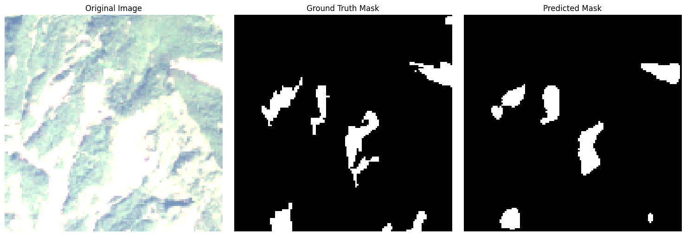
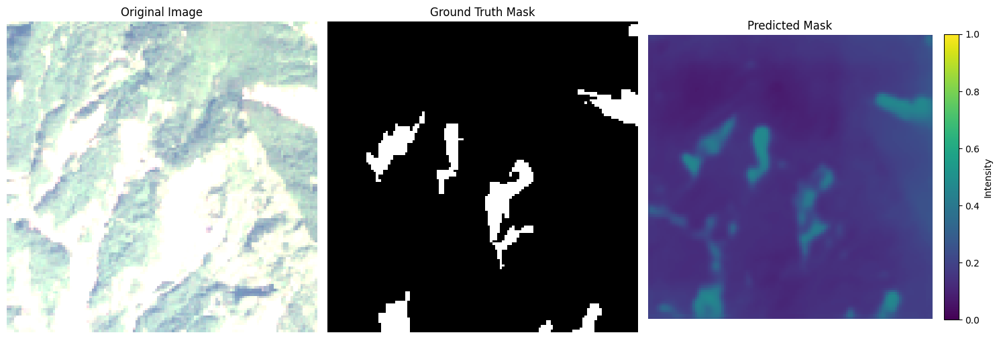
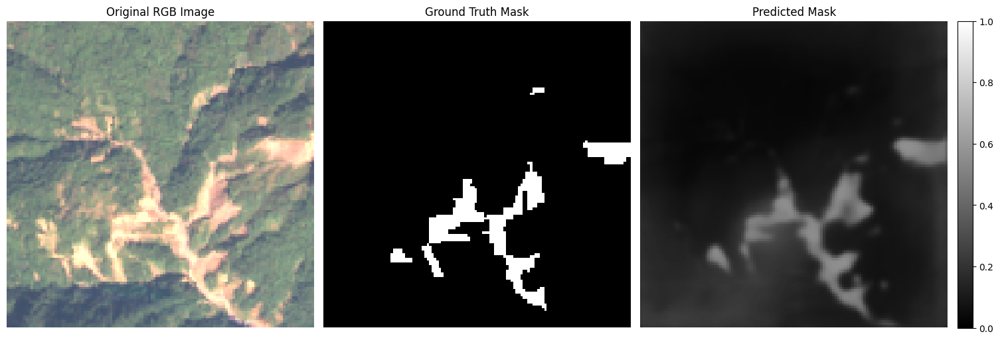
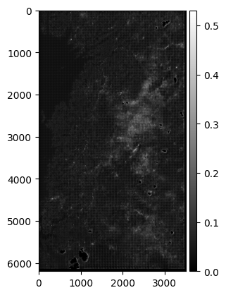

# Landslide4Sense Modeling

## Overview
This project aims to build a U-Net++ deep learning model to segment landslides from relevant imagery. Remotely sensed data from Sentinel-2 is used, along with slope and DEM, to train the model to identify regions that have been affected by landslide activity. There is a start to using the model as a means to predict regions most susceptible to landslides as well.

---

# Research Questions
Through this project I aim to answer the following:
- Can we train a machine learning model to segment regions affected by landslides?
- Can we use the model to predict locations that are most likely to be affected by landslides?
- Can we achieve similar results on less input data/bands from the imagery?

# Data Description
- **Data Source:** [Landslide4Sense](https://github.com/iarai/Landslide4Sense-2022?tab=readme-ov-file#landslide4sense-2022)
- **14 Bands/Channels Total**
  - 12 From Sentinel-2
  - Slope
  - Digital Elevation Model (DEM)

---

The dataset is split using 80/20 and standardized on a per-channel basis. Data augmentation is employed using random flips and rotations to improve performance and robustness. Binary focal cross entropy loss along with Adam optimizer are used with a learning rate of 1e-3.

---

The early model results are shown above and it's clear that this model has a general sense of where landslide activity has occurred but lacks the precision in segmenting a clear landslide boundary.

---

Eventually, through continuing training and tuning, I reach a model that has improved segmentations and is able to better capture each of regions where landslides have happened. The final F1 Score reached ~65%, which is comparable to the results from the original paper, achieving an F1 Score of around 70%.

---

  

A more recent effort focused on applying the model to regions known to have large landslide activity and predict the areas that have the highest susceptibility to this activity. This serves as a method of early warning detection and emergency response. The model is applied using satellite imagery from Rwanda, including all the same bands originally trained on.

---

## Tools & Methods
- Python, NumPy, TensorFlow/Keras
- U-Net++ architecture
- Sentinel-2 remote sensing data
- Geospatial preprocessing and data augmentation
